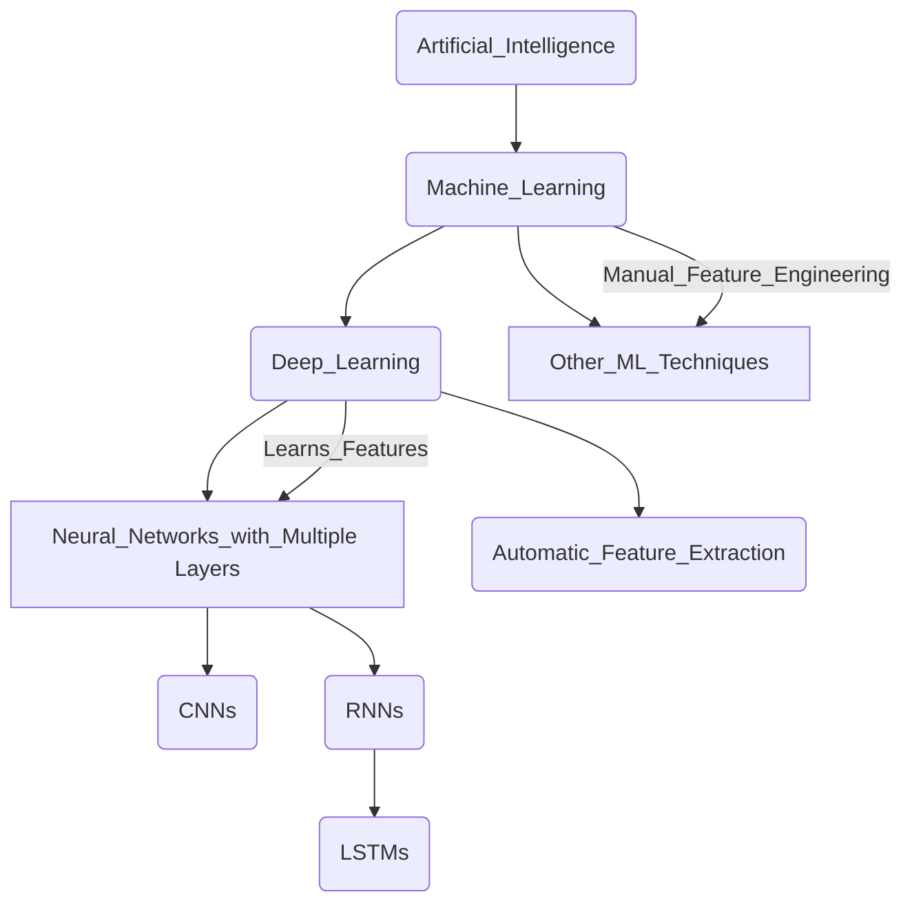

# 1. Introduction to Deep Learning

Deep learning is a subfield of machine learning that uses artificial neural networks with multiple layers (hence, "deep") to progressively extract higher-level features from raw input data.

Instead of relying on manually engineered features, deep learning models learn these features automatically from the data itself.

| Feature	| Traditional Machine Learning |	Deep Learning |
| -------	| ---------------------------- |	------------- |
| Feature Engineering	| Often requires manual identification and extraction of relevant features from the data.	| Learns features automatically from raw data through multiple layers. |
| Data Dependency	| Performs well on smaller datasets. Performance plateaus as data size increases.	| Performance often improves significantly with larger datasets. |
| Complexity	| Typically involves simpler models with fewer layers.	| Employs complex models with many layers (deep neural networks). |
| Computational Cost	| Relatively lower computational requirements.	| Significantly higher computational requirements due to the number of parameters. |
| Interpretability	| Models are often more interpretable (easier to understand why a decision was made).	| Models can be a "black box," making interpretability challenging. |
| Problem Domain	| Effective for a wide range of tasks, especially with well-defined features.	| Excels in complex tasks like image recognition, natural language processing, and speech recognition where feature engineering is difficult. |

Refer to [1. Difference between Machine Learning and Deep Learning.ipynb](https://github.com/atlas-github/nih_lstm/blob/main/1_Difference_between_Machine_Learning_and_Deep_Learning.ipynb) to see the difference at code level.

1. **Artificial Intelligence** (AI): This is the broadest field, encompassing any technique that enables computers to mimic human intelligence.
2. **Machine Learning** (ML): A subfield of AI that focuses on enabling computers to learn from data without being explicitly programmed. Instead of hard-coded rules, ML algorithms learn patterns and make predictions based on the data they are trained on.   
3. **Deep Learning** (DL): A subfield of Machine Learning. The key characteristic of deep learning is the use of neural networks with multiple layers (hence "deep").
4. **Other ML Techniques**: This branch represents the many other machine learning algorithms that are not deep learning. These include methods like Support Vector Machines (SVMs), Decision Trees, Naive Bayes, Linear Regression, and various clustering algorithms.
5. **Neural Networks with Multiple Layers**: This is the core of deep learning. These networks consist of interconnected nodes (neurons) organized into multiple layers (input, hidden, and output layers). The "depth" refers to the number of hidden layers.
6. **Convolutional Neural Networks** (CNNs): A specific type of deep neural network that is particularly well-suited for processing grid-like data, such as images. They use convolutional layers to automatically learn spatial hierarchies of features.   
7. **Recurrent Neural Networks** (RNNs): Another type of deep neural network designed to handle sequential data, such as text, time series, and audio. They have feedback connections that allow them to maintain a "memory" of past inputs.
8. **Long Short-Term Memory Networks** (LSTMs): A specific and powerful type of RNN architecture that is better at learning long-range dependencies in sequential data, overcoming some of the limitations of traditional RNNs.
9. **Feature Learning** (Automatic Feature Extraction): A crucial aspect that differentiates deep learning from many traditional ML techniques. Deep learning models automatically learn relevant features from raw data through their multiple layers. Each layer progressively extracts higher-level and more abstract features.

# 2. Environment Setup
## Installing and configuring Python
## Essential libraries for ML/DL (NumPy, Pandas, Matplotlib, TensorFlow, etc.)

# 3. Introduction to TensorFlow
## Understanding tensors in TensorFlow

# 4. Neural Networks
## Structure and function of neural networks
## Gradient descent optimization

# 5. Building Neural Networks
## Implementing simple feedforward networks

# 6. Convolutional Neural Networks (CNN)
## Using CNN for image recognition

# 7. Recurrent Neural Networks (RNN)
## Understanding RNN for sequential data processing

# 8. Hands-On Exercises

# 9. LSTM Architecture
## Addressing the vanishing gradient problem
## LSTM model structure and function

# 10. Practical Implementation
## Building LSTM models using TensorFlow
## Training LSTM on a time series dataset for dengue cases
## Developing a dengue forecasting model

# 11. Model Evaluation and Deployment
## Evaluating model performance using appropriate metrics
## Deploying the trained LSTM model

# 12. Advanced Techniques
## Model ensembling
## Hyperparameter tuning

# Others
## Hugging Face Transformer
