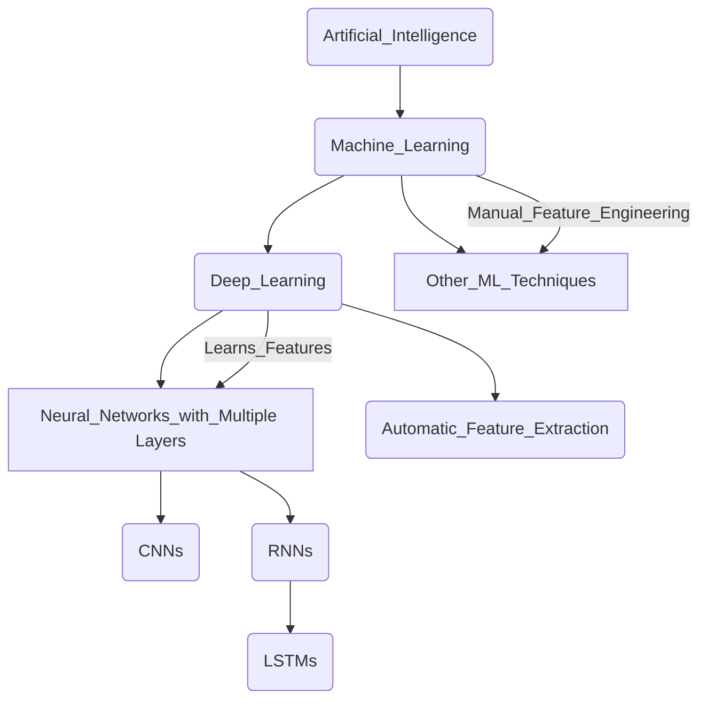

# 1. Introduction to Deep Learning

Deep learning is a subfield of machine learning that uses artificial neural networks with multiple layers (hence, "deep") to progressively extract higher-level features from raw input data.

Instead of relying on manually engineered features, deep learning models learn these features automatically from the data itself.

| Feature	| Traditional Machine Learning |	Deep Learning |
| -------	| ---------------------------- |	------------- |
| Feature Engineering	| Often requires manual identification and extraction of relevant features from the data.	| Learns features automatically from raw data through multiple layers. |
| Data Dependency	| Performs well on smaller datasets. Performance plateaus as data size increases.	| Performance often improves significantly with larger datasets. |
| Complexity	| Typically involves simpler models with fewer layers.	| Employs complex models with many layers (deep neural networks). |
| Computational Cost	| Relatively lower computational requirements.	| Significantly higher computational requirements due to the number of parameters. |
| Interpretability	| Models are often more interpretable (easier to understand why a decision was made).	| Models can be a "black box," making interpretability challenging. |
| Problem Domain	| Effective for a wide range of tasks, especially with well-defined features.	| Excels in complex tasks like image recognition, natural language processing, and speech recognition where feature engineering is difficult. |

Refer to [1. Difference between Machine Learning and Deep Learning.ipynb](https://github.com/atlas-github/nih_lstm/blob/main/1_Difference_between_Machine_Learning_and_Deep_Learning.ipynb) to see the difference at code level.



1. **Artificial Intelligence** (AI): This is the broadest field, encompassing any technique that enables computers to mimic human intelligence.
2. **Machine Learning** (ML): A subfield of AI that focuses on enabling computers to learn from data without being explicitly programmed. Instead of hard-coded rules, ML algorithms learn patterns and make predictions based on the data they are trained on.   
3. **Deep Learning** (DL): A subfield of Machine Learning. The key characteristic of deep learning is the use of neural networks with multiple layers (hence "deep").
4. **Other ML Techniques**: This branch represents the many other machine learning algorithms that are not deep learning. These include methods like Support Vector Machines (SVMs), Decision Trees, Naive Bayes, Linear Regression, and various clustering algorithms.
5. **Neural Networks with Multiple Layers**: This is the core of deep learning. These networks consist of interconnected nodes (neurons) organized into multiple layers (input, hidden, and output layers). The "depth" refers to the number of hidden layers.
6. **Convolutional Neural Networks** (CNNs): A specific type of deep neural network that is particularly well-suited for processing grid-like data, such as images. They use convolutional layers to automatically learn spatial hierarchies of features.   
7. **Recurrent Neural Networks** (RNNs): Another type of deep neural network designed to handle sequential data, such as text, time series, and audio. They have feedback connections that allow them to maintain a "memory" of past inputs.
8. **Long Short-Term Memory Networks** (LSTMs): A specific and powerful type of RNN architecture that is better at learning long-range dependencies in sequential data, overcoming some of the limitations of traditional RNNs.
9. **Feature Learning** (Automatic Feature Extraction): A crucial aspect that differentiates deep learning from many traditional ML techniques. Deep learning models automatically learn relevant features from raw data through their multiple layers. Each layer progressively extracts higher-level and more abstract features.

# 2. Environment Setup
## Installing and configuring Python

### Part 1: Installing Python and Essential Libraries (for Local Setup)

These steps are for setting up Python on your local machine. If you plan to primarily use Google Colab, you can largely skip this section as Python and many necessary libraries are pre-installed there.

Install Python:
1. Go to the official Python website: https://www.python.org/downloads/
2. Download the latest stable version of Python 3.
3. Run the installer. **Crucially, make sure to check the box that says "Add Python to PATH" during the installation.** This allows you to run Python from your command prompt or terminal.
4. Follow the on-screen instructions to complete the installation.
5. Open your command prompt (Windows) or terminal (macOS/Linux).
6. Type `python --version` or `python3 --version` and press Enter. You should see the Python version you installed.   
7. Type `pip --version` and press Enter. `pip` is the package installer for Python, which you'll use to install libraries. If you don't see a version, you might need to reinstall Python and ensure "Add Python to PATH" was checked.

Install Essential Libraries:
1. Open your command prompt or terminal.
2. Run the following command to install core libraries for data science and machine learning: `pip install numpy pandas matplotlib scikit-learn`
3. **NumPy**: For numerical computations and array manipulation.
4. **Pandas**: For data analysis and working with DataFrames.
5. **Matplotlib**: For creating plots and visualizations.
6. **Scikit-learn**: For various machine learning algorithms and tools.

Run the following command to install TensorFlow (a popular deep learning framework): `pip install tensorflow`

For GPU support with TensorFlow (requires compatible NVIDIA GPU and drivers), you might need to install the GPU version: `pip install tensorflow[tensorflow-gpu]`

Run the following command to install Keras (a high-level API for building neural networks, often used with TensorFlow): `pip install keras`

### Part 2: Setting up Jupyter Notebook (Local Environment)

Jupyter Notebook provides an interactive environment for writing and running Python code, making it excellent for workshops and experimentation.

1. Open your command prompt or terminal.
2. Run the command: `pip install notebook`
3. Open your command prompt or terminal.
4. Navigate to the directory where you want to store your notebooks (or simply stay in your user directory).
5. Run the command: `jupyter notebook`
6. This will open a new tab in your web browser with the Jupyter Notebook interface. You can create new Python 3 notebooks by clicking the "New" dropdown in the top right and selecting "Python 3 (ipykernel)".

### Part 3: Using Google Colab (Cloud Environment)

Google Colaboratory (Colab) is a free, cloud-based Jupyter Notebook environment that requires no setup and provides free access to GPUs (for limited usage). This is often the easiest way to get started for workshops, especially if participants have varying local setups.

1. Open your web browser and go to: https://colab.research.google.com/. You will need a Google account to use Colab.
2. On the Colab welcome page, you can choose to create a "New notebook" or open existing notebooks from your Google Drive or GitHub.
3. Colab comes with Python and many common data science and machine learning libraries (including NumPy, Pandas, Matplotlib, Scikit-learn, TensorFlow, and Keras) pre-installed. You usually don't need to install them explicitly.
4. In a Colab notebook cell, you can run commands like:

```
    import tensorflow as tf
    print("TensorFlow version:", tf.version)

    import keras
    print("Keras version:", keras.__version__)

    import numpy as np
    print("NumPy version:", np.__version__)

    import pandas as pd
    print("Pandas version:", pd.__version__)

    import sklearn
    print("Scikit-learn version:", sklearn.__version__)

    import matplotlib.pyplot as plt
    print("Matplotlib version:", plt.__version__)
    ```
    This helps you verify the versions of the libraries you'll be using.
```

5. Colab offers free GPU acceleration. To enable it for a notebook, go to "Runtime" in the menu bar.
6. Select "Change runtime type".
7. Under "Hardware accelerator," choose "GPU" and click "Save."
8. You can verify if a GPU is being used with the following code in a notebook cell:

```
import tensorflow as tf
print("Num GPUs Available: ", len(tf.config.list_physical_devices('GPU')))

## Essential libraries for ML/DL (NumPy, Pandas, Matplotlib, TensorFlow, etc.)
```

# 3. Introduction to TensorFlow
## Understanding tensors in TensorFlow

# 4. Neural Networks
## Structure and function of neural networks
## Gradient descent optimization

# 5. Building Neural Networks
## Implementing simple feedforward networks

# 6. Convolutional Neural Networks (CNN)
## Using CNN for image recognition

# 7. Recurrent Neural Networks (RNN)
## Understanding RNN for sequential data processing

# 8. Hands-On Exercises

# 9. LSTM Architecture
## Addressing the vanishing gradient problem
## LSTM model structure and function

# 10. Practical Implementation
## Building LSTM models using TensorFlow
## Training LSTM on a time series dataset for dengue cases
## Developing a dengue forecasting model

# 11. Model Evaluation and Deployment
## Evaluating model performance using appropriate metrics
## Deploying the trained LSTM model

# 12. Advanced Techniques
## Model ensembling
## Hyperparameter tuning

# Others
## Hugging Face Transformer
