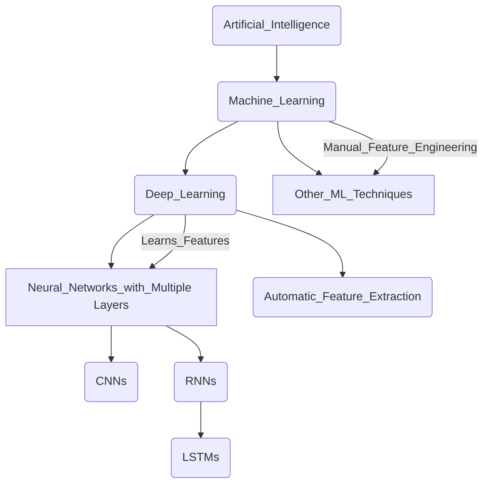

# 1. Introduction to Deep Learning

Deep learning is a subfield of machine learning that uses artificial neural networks with multiple layers (hence, "deep") to progressively extract higher-level features from raw input data.

Instead of relying on manually engineered features, deep learning models learn these features automatically from the data itself.

| Feature	| Traditional Machine Learning |	Deep Learning |
| -------	| ---------------------------- |	------------- |
| Feature Engineering	| Often requires manual identification and extraction of relevant features from the data.	| Learns features automatically from raw data through multiple layers. |
| Data Dependency	| Performs well on smaller datasets. Performance plateaus as data size increases.	| Performance often improves significantly with larger datasets. |
| Complexity	| Typically involves simpler models with fewer layers.	| Employs complex models with many layers (deep neural networks). |
| Computational Cost	| Relatively lower computational requirements.	| Significantly higher computational requirements due to the number of parameters. |
| Interpretability	| Models are often more interpretable (easier to understand why a decision was made).	| Models can be a "black box," making interpretability challenging. |
| Problem Domain	| Effective for a wide range of tasks, especially with well-defined features.	| Excels in complex tasks like image recognition, natural language processing, and speech recognition where feature engineering is difficult. |

Refer to [1. Difference between Machine Learning and Deep Learning.ipynb](https://github.com/atlas-github/nih_lstm/blob/main/1_Difference_between_Machine_Learning_and_Deep_Learning.ipynb) to see the difference at code level.



1. **Artificial Intelligence** (AI): This is the broadest field, encompassing any technique that enables computers to mimic human intelligence.
2. **Machine Learning** (ML): A subfield of AI that focuses on enabling computers to learn from data without being explicitly programmed. Instead of hard-coded rules, ML algorithms learn patterns and make predictions based on the data they are trained on.   
3. **Deep Learning** (DL): A subfield of Machine Learning. The key characteristic of deep learning is the use of neural networks with multiple layers (hence "deep").
4. **Other ML Techniques**: This branch represents the many other machine learning algorithms that are not deep learning. These include methods like Support Vector Machines (SVMs), Decision Trees, Naive Bayes, Linear Regression, and various clustering algorithms.
5. **Neural Networks with Multiple Layers**: This is the core of deep learning. These networks consist of interconnected nodes (neurons) organized into multiple layers (input, hidden, and output layers). The "depth" refers to the number of hidden layers.
6. **Convolutional Neural Networks** (CNNs): A specific type of deep neural network that is particularly well-suited for processing grid-like data, such as images. They use convolutional layers to automatically learn spatial hierarchies of features.   
7. **Recurrent Neural Networks** (RNNs): Another type of deep neural network designed to handle sequential data, such as text, time series, and audio. They have feedback connections that allow them to maintain a "memory" of past inputs.
8. **Long Short-Term Memory Networks** (LSTMs): A specific and powerful type of RNN architecture that is better at learning long-range dependencies in sequential data, overcoming some of the limitations of traditional RNNs.
9. **Feature Learning** (Automatic Feature Extraction): A crucial aspect that differentiates deep learning from many traditional ML techniques. Deep learning models automatically learn relevant features from raw data through their multiple layers. Each layer progressively extracts higher-level and more abstract features.

# 2. Environment Setup
## Installing and configuring Python

### Part 1: Installing Python and Essential Libraries (for Local Setup)

Install Python:
1. Go to the official Python website: https://www.python.org/downloads/
2. Download the latest stable version of Python 3.
3. Run the installer. **Crucially, make sure to check the box that says "Add Python to PATH" during the installation.** This allows Python to run from command prompt or terminal.
4. Follow the on-screen instructions to complete the installation.
5. Open command prompt (Windows) or terminal (macOS/Linux).
6. Type `python --version` or `python3 --version` and press Enter. The installed Python version should appear.   
7. Type `pip --version` and press Enter. `pip` is the package installer for Python, which is used to install libraries. If there's no version, reinstall Python and ensure "Add Python to PATH" was checked.

Install Essential Libraries:
1. Open command prompt or terminal.
2. Run the following command to install core libraries for data science and machine learning: `pip install numpy pandas matplotlib scikit-learn`
3. **NumPy**: For numerical computations and array manipulation.
4. **Pandas**: For data analysis and working with DataFrames.
5. **Matplotlib**: For creating plots and visualizations.
6. **Scikit-learn**: For various machine learning algorithms and tools.

Run the following command to install TensorFlow (a popular deep learning framework): `pip install tensorflow`

For GPU support with TensorFlow (requires compatible NVIDIA GPU and drivers), install the GPU version: `pip install tensorflow[tensorflow-gpu]`

Run the following command to install Keras (a high-level API for building neural networks, often used with TensorFlow): `pip install keras`

### Part 2: Setting up Jupyter Notebook (Local Environment)

Jupyter Notebook provides an interactive environment for writing and running Python code, making it excellent for workshops and experimentation.

1. Open command prompt or terminal.
2. Run the command: `pip install notebook`
3. Open command prompt or terminal.
4. Navigate to the directory where notebooks are to be saved (or simply stay in the user directory).
5. Run the command: `jupyter notebook`
6. This will open a new tab in the web browser with the Jupyter Notebook interface. Create new Python 3 notebooks by clicking the "New" dropdown in the top right and selecting "Python 3 (ipykernel)".

### Part 3: Using Google Colab (Cloud Environment)

Google Colaboratory (Colab) is a free, cloud-based Jupyter Notebook environment that requires no setup and provides free access to GPUs (for limited usage). This is often the easiest way to get started for workshops, especially if participants have varying local setups.

1. Open a web browser and go to: https://colab.research.google.com/. A Google account is needed to use Colab.
2. On the Colab welcome page, choose to create a "New notebook" or open existing notebooks from Google Drive or GitHub.
3. Colab comes with Python and many common data science and machine learning libraries (including NumPy, Pandas, Matplotlib, Scikit-learn, TensorFlow, and Keras) pre-installed. Many don't need to be installed explicitly.
4. In a Colab notebook cell, run commands like:

```
    import tensorflow as tf
    print("TensorFlow version:", tf.version)

    import keras
    print("Keras version:", keras.__version__)

    import numpy as np
    print("NumPy version:", np.__version__)

    import pandas as pd
    print("Pandas version:", pd.__version__)

    import sklearn
    print("Scikit-learn version:", sklearn.__version__)

    import matplotlib.pyplot as plt
    print("Matplotlib version:", plt.__version__)
    ```
    This helps to verify the versions of the libraries.
```

5. Colab offers free GPU acceleration. To enable it for a notebook, go to "Runtime" in the menu bar.
6. Select "Change runtime type".
7. Under "Hardware accelerator," choose "GPU" and click "Save."
8. Verify if a GPU is being used with the following code in a notebook cell:

```
import tensorflow as tf
print("Num GPUs Available: ", len(tf.config.list_physical_devices('GPU')))

## Essential libraries for ML/DL (NumPy, Pandas, Matplotlib, TensorFlow, etc.)
```

# 3. Introduction to TensorFlow

### Section 1: TensorFlow Overview and Basic Code
TensorFlow is a powerful open-source library developed by Google for numerical computation and large-scale machine learning. At its core, TensorFlow allows definingn and running computations involving tensors, which are multi-dimensional arrays. It provides a flexible architecture that can run on various platforms, including CPUs, GPUs, and TPUs (Tensor Processing Units), making it suitable for a wide range of applications from research to production. 

Key Concepts:
1. Computational Graph: TensorFlow represents computations as a directed graph. Each node in the graph represents an operation, and each edge represents the flow of data (tensors). This graph-based approach allows for efficient parallel execution and optimization.
2. Tensors: Tensors are the fundamental data units in TensorFlow. They are multi-dimensional arrays that can hold various data types (e.g., integers, floats, strings).
3. Operations (Ops): These are the nodes in the computational graph that perform computations on tensors. Examples include addition, multiplication, matrix operations, and activation functions.
4. Variables: These are tensor objects that can hold and update state during the execution of a graph. They are often used to represent model parameters (e.g., weights and biases in a neural network).
5. Keras API: TensorFlow provides a high-level API called Keras, which simplifies the process of building and training neural networks. It offers a more user-friendly interface for common machine learning tasks.

Basic Code Example:
```
# Installs Tensorflow library
pip install tensorflow
```

```
import tensorflow as tf

# Define constant tensors
tensor_a = tf.constant([[1, 2], [3, 4]], dtype=tf.float32)
tensor_b = tf.constant([[5, 6], [7, 8]], dtype=tf.float32)

print("Tensor A:\n", tensor_a)
print("Tensor B:\n", tensor_b)

# Perform basic operations
tensor_sum = tf.add(tensor_a, tensor_b)
tensor_product = tf.matmul(tensor_a, tensor_b)

print("\nSum of Tensors:\n", tensor_sum)
print("Product of Tensors:\n", tensor_product)

# Create a variable tensor
initial_value = tf.constant(10.0)
variable_tensor = tf.Variable(initial_value)
print("\nVariable Tensor:", variable_tensor)

# Update the variable
variable_tensor.assign(20.0)
print("Updated Variable Tensor:", variable_tensor)
```

## Understanding tensors in TensorFlow

Tensors are the core building blocks of TensorFlow. Think of them as generalized matrices that can have any number of dimensions.

Key Attributes of a Tensor:
1. Rank (Number of Dimensions): The rank of a tensor is the number of axes or dimensions it has.
2. A scalar (a single number) has a rank of 0.
3. A vector (a 1D array) has a rank of 1.
4. A matrix (a 2D array) has a rank of 2.
5. Tensors with more than two dimensions are often referred to as n-tensors.
6. Shape: The shape of a tensor is a tuple of integers describing the size of each dimension. For a matrix with m rows and n columns, the shape would be (m,n).
7. Data Type (dtype): This specifies the type of data stored in the tensor, such as `tf.float32`, `tf.int32`, `tf.string`, etc. All elements within a tensor must have the same data type.

```
import tensorflow as tf

# Scalar (rank 0)
scalar_tensor = tf.constant(10)
print("Scalar Tensor:", scalar_tensor)
print("Rank:", tf.rank(scalar_tensor))
print("Shape:", scalar_tensor.shape)

# Vector (rank 1)
vector_tensor = tf.constant([1, 2, 3, 4, 5])
print("\nVector Tensor:", vector_tensor)
print("Rank:", tf.rank(vector_tensor))
print("Shape:", vector_tensor.shape)

# Matrix (rank 2)
matrix_tensor = tf.constant([[1, 2], [3, 4], [5, 6]])
print("\nMatrix Tensor:\n", matrix_tensor)
print("Rank:", tf.rank(matrix_tensor))
print("Shape:", matrix_tensor.shape)

# 3D Tensor (rank 3)
tensor_3d = tf.constant([[[1, 2], [3, 4]], [[5, 6], [7, 8]]])
print("\n3D Tensor:\n", tensor_3d)
print("Rank:", tf.rank(tensor_3d))
print("Shape:", tensor_3d.shape)
```

In machine learning, data is often represented in multi-dimensional arrays. For example:
1. An image can be represented as a 3D tensor (height, width, color channels).
2. A batch of multiple images would be a 4D tensor (batch size, height, width, color channels).
3. Time series data can be a 3D tensor (batch size, time steps, features).

# 4. Neural Networks

Think of a neural network as a complex function approximator. Given an input, it processes it through multiple layers of interconnected nodes (neurons) to produce an output. The "learning" in neural networks happens by adjusting the connections (weights) between these neurons based on the data they are trained on.

Key Concepts:
1. Nodes (Neurons): The basic processing units of a neural network. They receive input, perform a computation, and produce an output.
2. Connections (Weights): Numerical values associated with the connections between neurons. These weights determine the strength of the influence one neuron has on another.
3. Layers: Neurons are typically organized into layers: an input layer, one or more hidden layers, and an output layer.
4. Activation Functions: Non-linear functions applied to the output of each neuron. These functions introduce non-linearity, allowing the network to learn complex patterns.

Why are they powerful?
1. Non-linearity: Activation functions enable neural networks to model complex, non-linear relationships in data.
2. Feature Learning: Hidden layers can automatically learn relevant features from the input data, eliminating the need for manual feature engineering in many cases.
3. Scalability: With enough data and computational resources, larger neural networks can learn highly intricate patterns.

## Structure and function of neural networks

A typical feedforward neural network consists of:

1. Input Layer: Receives the raw input data. The number of neurons in this layer corresponds to the number of input features.
2. Hidden Layers: One or more layers between the input and output layers. These layers perform the core computations and feature extraction. The number of hidden layers and the number of neurons in each hidden layer are architectural choices.
3. Output Layer: Produces the final output of the network. The number of neurons in this layer depends on the task (e.g., one neuron for binary classification, multiple neurons for multi-class classification or regression).   

Function:

Information flows through the network in a forward direction, from the input layer to the output layer. Here's what happens at each neuron in a hidden or output layer:

1. Weighted Sum of Inputs: Each neuron receives inputs from the neurons in the previous layer. Each input is multiplied by its corresponding weight.
2. Bias Addition: A bias term (an additional parameter) is added to the weighted sum. This allows the neuron to be activated even when all inputs are zero.
3. Activation Function: The result of the weighted sum plus bias is passed through an activation function. This introduces non-linearity and determines the output of the neuron.

Mathematically , for a neuron $j$ in a layer $l$, the output $a_j^\left(l\right)$ can be expressed as:

$$ z_j^\left(l\right) = \sum_{i} w_\left(ji\right)^\left(l\right)*a_i^\left(l-1\right) + b_j^\left(l\right)$$

$$ a_j^\left(l\right) = f(z_j^\left(l\right))$$

where:
1. $a_i^\left(l-1\right)$ is the activation of the $i$-th neuron in the previous layer $(l-1)$
2. $w_\left(ji\right)^\left(l\right)$ is the weight connecting the $i$-th neuron in the previous layer to the $j$-th neuron in the current layer $l$
3. $b_j^\left(l\right)$ is the bias of the $j$-th neuron in the current layer $l$
4. $f$ is the activation function
5. $z_j^\left(l\right)$ is the weighted sum of inputs plus bias

```
import numpy as np

def sigmoid(x):
  """The sigmoid activation function."""
  return 1 / (1 + np.exp(-x))

def forward_pass(input_data, weights, biases):
  """Performs a forward pass through a simple two-layer network."""
  # Hidden layer
  hidden_layer_input = np.dot(input_data, weights['hidden']) + biases['hidden']
  hidden_layer_output = sigmoid(hidden_layer_input)

  # Output layer
  output_layer_input = np.dot(hidden_layer_output, weights['output']) + biases['output']
  output_layer_output = sigmoid(output_layer_input)

  return output_layer_output

# Example usage:
input_size = 3
hidden_size = 4
output_size = 1
num_samples = 2

# Initialize random weights and biases
weights = {
    'hidden': np.random.rand(input_size, hidden_size),
    'output': np.random.rand(hidden_size, output_size)
}
biases = {
    'hidden': np.random.rand(hidden_size),
    'output': np.random.rand(output_size)
}

# Example input data
input_data = np.random.rand(num_samples, input_size)

# Perform forward pass
output = forward_pass(input_data, weights, biases)
print("Input Data:\n", input_data)
print("\nOutput:\n", output)
```

## Gradient descent optimization

The goal of training a neural network is to find the set of weights and biases that minimize a loss function. The loss function quantifies the difference between the network's predictions and the actual target values in the training data. 

Gradient descent is an iterative optimization algorithm used to find the minimum of a function. In the context of neural networks, this function is the loss function, and the parameters we want to optimize are the weights and biases.

The algorithm works by:

1. Calculating the Gradient: Computing the gradient of the loss function with respect to each weight and bias. The gradient indicates the direction of the steepest increase in the loss.
2. Updating Parameters: Adjusting the weights and biases in the opposite direction of the gradient. This moves the parameters towards a lower value of the loss function.
3. Learning Rate: A crucial hyperparameter called the learning rate (α) controls the step size taken during each parameter update. A small learning rate can lead to slow convergence, while a large learning rate might cause the algorithm to overshoot the minimum.

The update rule for a weight $w$ and bias $b$ is:

$$ w_\left(new\right) = w_\left(old\right) - α\frac{δL}{δw}$$

$$ b_\left(new\right) = B_\left(old\right) - α\frac{δL}{δw}$$

where $L$ is the loss function.

To efficiently calculate the gradients of the loss function with respect to all the weights and biases in a neural network, we use an algorithm called backpropagation. Backpropagation uses the chain rule of calculus to propagate the error from the output layer back through the network, calculating the contribution of each weight and bias to the overall error.

Let's consider a very simple case of optimizing a single parameter to minimize a simple quadratic loss function.

```
def loss_function(w):
  """A simple quadratic loss function."""
  return (w - 2)**2

def gradient(w):
  """The gradient of the loss function."""
  return 2 * (w - 2)

# Initial guess for the parameter
w = 0.0
learning_rate = 0.1
num_iterations = 5

print(f"Initial w: {w}, Loss: {loss_function(w)}")

for i in range(num_iterations):
  grad_w = gradient(w)
  w = w - learning_rate * grad_w
  print(f"Iteration {i+1}: w = {w:.4f}, Loss = {loss_function(w):.4f}")
```
In a real neural network, the loss function is much more complex, and backpropagation is used to calculate the gradients with respect to all the weights and biases. Libraries like TensorFlow and PyTorch automate this process, making it much easier to train complex neural networks.


# 5. Building Neural Networks
## Implementing simple feedforward networks

# 6. Convolutional Neural Networks (CNN)

## Using CNN for image recognition

# 7. Recurrent Neural Networks (RNN)
## Understanding RNN for sequential data processing

# 8. Hands-On Exercises 

##### TO BE FILLED IN #####

# 9. LSTM Architecture
## Addressing the vanishing gradient problem
## LSTM model structure and function

# 10. Practical Implementation
## Building LSTM models using TensorFlow

Long Short-Term Memory (LSTM) networks are a type of recurrent neural network (RNN) capable of learning long-range dependencies in sequential data. They are particularly well-suited for time series forecasting because they can remember past patterns and use them to predict future values.

In TensorFlow, build LSTM models using the `tf.keras` API, which provides a high-level interface for building and training neural networks. The core building block for an LSTM layer is `tf.keras.layers.LSTM`.

Here's a breakdown of the key components and how to build an LSTM model:

1. `tf.keras.models.Sequential`: This is a linear stack of layers, a common way to build simple neural network architectures. Add layers sequentially to this model.
2. `tf.keras.layers.LSTM(units, activation='tanh', return_sequences=False, stateful=False, ...)`: This is the [LSTM layer](https://www.tensorflow.org/api_docs/python/tf/keras/layers/LSTM) itself.
3. `tf.keras.layers.Dense(units, activation=None)`: This is a fully connected layer. In the context of time series forecasting, the final `Dense` layer typically has `units=1` (for predicting a single future value) and may or may not have an activation function depending on the desired output range.
4. Input Shape: The first layer in a `Sequential` model needs to know the shape of its input. For an LSTM layer, the input shape should be `(time_steps, features)`, where:
   - `time_steps`: The number of time steps in each input sequence. This is how many past data points the model will look at to make a prediction.
   - `features`: The number of features at each time step. For a univariate time series, this is typically 1. For multivariate time series, it's the number of different variables.

Python Code Example (Univariate Time Series):
```
import tensorflow as tf

# Define the model architecture
def build_lstm_model(time_steps, features, lstm_units, dense_units):
    model = tf.keras.models.Sequential([
        tf.keras.layers.LSTM(lstm_units, activation='tanh', input_shape=(time_steps, features)),
        tf.keras.layers.Dense(dense_units),
        tf.keras.layers.Dense(1) # Output layer for single value prediction
    ])
    return model

# Example usage:
time_steps = 20  # Look back 20 time steps
features = 1     # Univariate time series
lstm_units = 64  # Number of LSTM units
dense_units = 32 # Number of units in the dense layer

lstm_model = build_lstm_model(time_steps, features, lstm_units, dense_units)

# Compile the model
lstm_model.compile(optimizer='adam', loss='mse') # Mean Squared Error is common for regression

# Print the model summary to see the architecture
lstm_model.summary()
```
Python Code Example (Stacking LSTM Layers and Multivariate Time Series):
```
import tensorflow as tf

# Define the model architecture with stacked LSTMs
def build_stacked_lstm_model(time_steps, features, lstm_units_list, dense_units):
    model = tf.keras.models.Sequential()
    # First LSTM layer needs input shape
    model.add(tf.keras.layers.LSTM(lstm_units_list[0], activation='tanh', return_sequences=True, input_shape=(time_steps, features)))
    # Add subsequent LSTM layers, returning sequences for each except the last
    for units in lstm_units_list[1:-1]:
        model.add(tf.keras.layers.LSTM(units, activation='tanh', return_sequences=True))
    # Last LSTM layer only returns the final output
    model.add(tf.keras.layers.LSTM(lstm_units_list[-1], activation='tanh'))
    model.add(tf.keras.layers.Dense(dense_units))
    model.add(tf.keras.layers.Dense(1)) # Output layer for single value prediction
    return model

# Example usage:
time_steps = 30  # Look back 30 time steps
features = 3     # Multivariate time series with 3 features
lstm_units_list = [64, 64] # Two stacked LSTM layers with 64 units each
dense_units = 32

stacked_lstm_model = build_stacked_lstm_model(time_steps, features, lstm_units_list, dense_units)

# Compile the model
stacked_lstm_model.compile(optimizer='adam', loss='mse')

# Print the model summary
stacked_lstm_model.summary()
```

## Training LSTM on a time series dataset for dengue cases

Once LSTM model has been built, the next step is to train it on time series data. This involves preparing the data and then using the `fit()` method of the TensorFlow model.

**Data Preparation**:

Time series data needs to be structured into sequences that the LSTM can learn from. This typically involves:
1. Loading the Data: Load time series data (e.g., from a CSV file, database, or NumPy array).
2. Scaling: It's often beneficial to scale time series data (e.g., using `MinMaxScaler` or `StandardScaler` from `sklearn.preprocessing`) to bring the values within a similar range. This can help the model converge faster and prevent issues with large gradients. Remember to scale the target variable (the value to be predicted) as well.
3. Creating Sequences (Sliding Window): Create input-output pairs for training. For each sequence of `time_steps` past values, the target will be the next value (or a sequence of future values for more advanced forecasting). This can be done using a sliding window approach.

```
import numpy as np
from sklearn.preprocessing import MinMaxScaler

# Sample univariate time series data
time_series = np.array([10, 12, 15, 13, 16, 18, 20, 19, 22, 25, 23, 26, 28, 30, 29])
time_series = time_series.reshape(-1, 1) # Reshape for scaling

# Scale the data
scaler = MinMaxScaler()
scaled_data = scaler.fit_transform(time_series)

# Define the number of time steps to look back
time_steps = 3

# Create sequences and targets
def create_sequences(data, time_steps):
    X, y = [], []
    for i in range(len(data) - time_steps):
        X.append(data[i:(i + time_steps)])
        y.append(data[i + time_steps])
    return np.array(X), np.array(y)

X, y = create_sequences(scaled_data, time_steps)

print("Shape of X (input sequences):", X.shape)
print("Shape of y (target values):", y.shape)

# Split the data into training and testing sets
train_size = int(len(X) * 0.8)
X_train, X_test = X[:train_size], X[train_size:]
y_train, y_test = y[:train_size], y[train_size:]

print("Shape of X_train:", X_train.shape)
print("Shape of y_train:", y_train.shape)
print("Shape of X_test:", X_test.shape)
print("Shape of y_test:", y_test.shape)
```

**Training the Model**:
Once data is prepared into input sequences (`X_train`) and corresponding target values (`y_train`), train LSTM model using the `fit()` method.

```
# Assuming lstm_model has been built and compiled (from the first section)
# and prepared training data (X_train, y_train)

# Train the model
history = lstm_model.fit(
    X_train,
    y_train,
    epochs=100,      # Number of training iterations
    batch_size=32,   # Number of samples per gradient update
    validation_split=0.2, # Fraction of the training data to be used as validation data
    shuffle=False     # Important for time series data to avoid shuffling the order
)

# Access the training history (loss, validation loss)
print(history.history.keys())

import matplotlib.pyplot as plt

# Plot training & validation loss values
plt.plot(history.history['loss'], label='Train')
plt.plot(history.history['val_loss'], label='Validation')
plt.title('Model loss')
plt.ylabel('Loss')
plt.xlabel('Epoch')
plt.legend(loc='upper right')
plt.show()
```

Important Considerations for Training:

1. Epochs: The number of times the entire training dataset is passed forward and backward through the neural network. Experiment with different numbers of epochs.
2. Batch Size: The number of training examples utilized in one iteration. Smaller batch sizes can lead to noisy gradients but may generalize better. Larger batch sizes can speed up training but might get stuck in local minima.
3. Validation Set: It's crucial to have a separate validation set to monitor the model's performance on unseen data during training. This helps in tuning hyperparameters and preventing overfitting.
4. Shuffle: For time series data, set `shuffle=False` in the `fit()` method to preserve the temporal order of the data. Shuffling can disrupt the sequential dependencies that the LSTM is trying to learn.
5. Callbacks: TensorFlow provides callbacks that can be used during training for various purposes, such as early stopping (to prevent overfitting), saving the best model, and adjusting the learning rate.

After training, evaluate model on the test data (`X_test`, `y_test`) using the `evaluate()` method and make predictions on new, unseen data using the `predict()` method. Remember to inverse transform the scaled predictions back to the original scale if data has been scaled.


## Developing a dengue forecasting model

##### TO BE FILLED IN #####

# 11. Model Evaluation and Deployment
## Evaluating model performance using appropriate metrics
When training a LSTM (Long Short-Term Memory) network, assess how well it's performing. The choice of evaluation metrics depends heavily on the specific task your LSTM is designed for. Here are some common scenarios and their appropriate metrics for time-series forecasting:

1. **Mean Squared Error (MSE)**: This is a classic metric that calculates the average of the squared differences between the predicted and actual values. It penalizes larger errors more heavily.

$$ MSE= \frac{1}{n} * \left( \sum_{i=1}^n (y_i - \hat{y_i})^2 \right) $$

2. **Root Mean Squared Error (RMSE)**: The square root of the MSE, providing an error metric in the same units as the target variable, making it more interpretable.

$$ RMSE= \sqrt{ \frac{1}{n} * \left( \sum_{i=1}^n (y_i - \hat{y_i})^2 \right) }$$

3. **Mean Absolute Error (MAE)**: This calculates the average of the absolute differences between the predicted and actual values. It's less sensitive to outliers compared to MSE.

$$ MAE= \frac{1}{n} * \left( \sum_{i=1}^n |y_i - \hat{y_i}| \right) $$

4. **R-squared** (Coefficient of Determination): This metric represents the proportion of the variance in the dependent variable that is predictable from the independent variables. A value closer to 1 indicates a better fit.

$$ R^2 = 1- \left(\frac{\sum_{i=1}^n (y_i - \hat{y_i})^2}{\sum_{i=1}^n (y_i - \bar{y})^2} \right) $$, where $\bar{y}$ is the mean of the actual values.

5. Mean Absolute Percentage Error (MAPE): This expresses the error as a percentage of the actual values. It's useful for understanding the relative size of the errors. Be cautious when actual values are close to zero, as MAPE can become very large.

$$ MAPE = \frac{1}{n} * \left( \sum_{i=1}^n \left|\frac{y_i - \hat{y_i}}{y_i}\right| \right) $$

```
from sklearn.metrics import mean_squared_error, mean_absolute_error, r2_score
import numpy as np

# Assume 'y_true' and 'y_pred' are actual and predicted time series values
y_true = np.array([10, 12, 15, 13, 18])
y_pred = np.array([9.5, 11.8, 14.5, 13.2, 17.5])

mse = mean_squared_error(y_true, y_pred)
rmse = np.sqrt(mse)
mae = mean_absolute_error(y_true, y_pred)
r_squared = r2_score(y_true, y_pred)

def mean_absolute_percentage_error(y_true, y_pred):
    y_true, y_pred = np.array(y_true), np.array(y_pred)
    return np.mean(np.abs((y_true - y_pred) / y_true)) * 100

mape = mean_absolute_percentage_error(y_true, y_pred)

print(f"Mean Squared Error (MSE): {mse:.4f}")
print(f"Root Mean Squared Error (RMSE): {rmse:.4f}")
print(f"Mean Absolute Error (MAE): {mae:.4f}")
print(f"R-squared (R2): {r_squared:.4f}")
print(f"Mean Absolute Percentage Error (MAPE): {mape:.4f}%")
```

## Deploying the trained LSTM model

Cloud Platforms (AWS, Google Cloud, Azure):
1. Pros: Scalability, reliability, managed services, integration with other cloud services (databases, APIs, etc.).
2. Cons: Can be costlier depending on usage, requires cloud infrastructure knowledge.
3. Options:
   - Serverless Functions (AWS Lambda, Google Cloud Functions, Azure Functions): Ideal for event-driven applications or APIs where need on-demand inference without managing servers. Package model and prediction logic into a function.
   - Containerized Deployment (Docker on ECS, GKE, AKS): Package model and its dependencies into a Docker container and deploy it on a container orchestration service. This provides flexibility and scalability.
   - Managed Machine Learning Services (AWS SageMaker, Google AI Platform, Azure Machine Learning): These platforms offer end-to-end ML workflows, including model deployment with features like auto-scaling, monitoring, and A/B testing.
   - Virtual Machines (EC2, Compute Engine, Azure VMs): Set up a virtual machine, install the necessary libraries, and run model as a service. This gives more control over the environment.

Web Applications:
1. Pros: Easy accessibility for users through a web browser.
2. Cons: Requires building a web interface and backend infrastructure.
3. Options:
   - REST API (using Flask, FastAPI, Django REST Framework): Expose trained model as an API endpoint. The web application can send data to the API and receive predictions. Deploy the API on cloud platforms or a dedicated server.
   - Streamlit or Gradio: These Python libraries allow for quick creation of interactive web interfaces for machine learning models with minimal coding. They are great for demos and internal tools.
  
Desktop Applications: Jupyter Notebook, Power BI Desktop, Tableau

Considerations:
1. Performance Requirements: Latency, throughput, and resource usage.
2. Scalability: How will the deployment handle increasing load?
3. Cost: Infrastructure costs, development effort.
4. Security: Protecting model and data.
5. Maintenance: Updating the model, monitoring performance.
6. Ease of Use: How easy is it for end-users to interact with the deployed model?

# 12. Advanced Techniques
## Model ensembling
Model ensembling is a powerful technique that combines the predictions of multiple individual models to produce a single, often more accurate and robust prediction. The intuition behind it is that different models might capture different aspects of the underlying data patterns, and by aggregating their predictions, we can reduce individual model errors and biases.

Here's a breakdown of common ensembling methods applicable to LSTMs and other neural networks:

### Averaging:
1. This is the simplest ensembling technique. Train multiple independent models on the same data and then average their predictions.
2. It works well when the individual models have comparable performance.
3. Benefit: Easy to implement and can lead to a smoother and more stable prediction.

### Weighted Averaging:
1. Similar to averaging, but assign different weights to the predictions of each model based on their estimated performance (e.g., validation accuracy).
2. Models with higher estimated performance contribute more to the final prediction.
3. Benefit: Can potentially yield better results than simple averaging

### Majority Voting:
1. For classification tasks, each model predicts a class label, and the final prediction is the class that receives the majority of the votes.
2. Benefit: Robust to individual model errors, especially when the number of models is large.

### Stacking:
1. This is a more sophisticated technique where the predictions of the base models are used as input features for a "meta-learner" model.
2. The meta-learner is trained to learn the optimal way to combine the predictions of the base models.
3. Benefit: Can potentially learn complex relationships between the base model predictions and achieve higher accuracy.
4. Consideration: More complex to implement and requires training an additional meta-learner model.

```
import numpy as np
from tensorflow import keras
from sklearn.model_selection import train_test_split

# Generate some dummy data for demonstration
np.random.seed(42)
X = np.random.rand(100, 10, 1)  # Sequence data
y = np.random.randint(0, 2, 100) # Binary classification labels
X_train, X_val, y_train, y_val = train_test_split(X, y, test_size=0.2, random_state=42)

def create_lstm_model():
    model = keras.Sequential([
        keras.layers.LSTM(32, input_shape=(10, 1)),
        keras.layers.Dense(1, activation='sigmoid')
    ])
    model.compile(optimizer='adam', loss='binary_crossentropy', metrics=['accuracy'])
    return model

# Create and train multiple LSTM models
num_models = 3
models = [create_lstm_model() for _ in range(num_models)]

for i, model in enumerate(models):
    print(f"Training model {i+1}...")
    model.fit(X_train, y_train, epochs=5, verbose=0)

# Make predictions with each model
predictions = [model.predict(X_val) for model in models]

# Average the predictions
averaged_predictions = np.mean(predictions, axis=0)

# Evaluate the ensemble (for binary classification)
ensemble_accuracy = np.mean((averaged_predictions > 0.5).astype(int) == y_val)
print(f"\nEnsemble Validation Accuracy (Averaging): {ensemble_accuracy:.4f}")
```

In this example, create three identical LSTM models, train them independently, and then average their predictions on the validation set.

## Hyperparameter tuning

Hyperparameters are parameters of a learning algorithm that are set prior to the learning process and control its behavior. Finding the optimal set of hyperparameters is crucial for achieving the best performance from the LSTM model or neural network.

Here are some common hyperparameter tuning techniques:

### Manual Tuning:
1. This involves manually experimenting with different hyperparameter values based on intuition, experience, and understanding of the model and data.
2. Benefit: Can provide valuable insights into the impact of individual hyperparameters.
3. Drawback: Time-consuming and may not explore the search space efficiently.

### Grid Search:
1. Define a discrete set of values for each hyperparameter to tune.
2. The algorithm then systematically evaluates all possible combinations of these values.
3. Benefit: Exhaustive search within the defined grid.
4. Drawback: Can become computationally very expensive as the number of hyperparameters and the size of their value ranges increase (curse of dimensionality).

### Random Search:
1. Instead of trying all combinations, define a range or distribution for each hyperparameter, and the algorithm randomly samples a fixed number of hyperparameter settings and evaluates them.
2. Benefit: More efficient than grid search, especially when some hyperparameters have a larger impact on performance than others. It has a higher chance of finding better hyperparameter combinations within a given budget.
3. Drawback: May not explore the entire search space systematically.

### Bayesian Optimization:
1. This is a more sophisticated optimization technique that uses probabilistic models (e.g., Gaussian processes) to model the objective function (e.g., validation accuracy) and intelligently select the next set of hyperparameters to evaluate.
2. It aims to find the optimal hyperparameters with fewer evaluations than grid or random search by balancing exploration and exploitation of the search space.   
3. Benefit: More efficient than grid and random search, especially for high-dimensional and expensive-to-evaluate hyperparameter spaces.
4. Drawback: More complex to implement and tune the Bayesian optimization process itself.

```
!pip install keras-tuner
```

```
import numpy as np
import tensorflow as tf
from tensorflow import keras
from sklearn.model_selection import train_test_split
import keras_tuner as kt

# Generate dummy data
np.random.seed(42)
X = np.random.rand(100, 10, 1)
y = np.random.randint(0, 2, 100)
X_train, X_val, y_train, y_val = train_test_split(X, y, test_size=0.2, random_state=42)

# Defines LSTM model architecture
def build_model(hp):
    units = hp.Int('units', min_value=16, max_value=64, step=16)
    optimizer = hp.Choice('optimizer', values=['adam', 'rmsprop'])
    model = keras.Sequential([
        keras.layers.LSTM(units, input_shape=(10, 1)),
        keras.layers.Dense(1, activation='sigmoid')
    ])
    model.compile(optimizer=optimizer, loss='binary_crossentropy', metrics=['accuracy'])
    return model

tuner = kt.GridSearch(
    build_model,
    objective='val_accuracy',
    max_trials=6,  # Number of hyperparameter combinations to try
    directory='keras_tuner_dir',
    project_name='lstm_hyperparameter_tuning'
)

tuner.search(X_train, y_train, epochs=5, validation_data=(X_val, y_val))

# Get the best hyperparameters
best_hps = tuner.get_best_hyperparameters(num_trials=1)[0]
print(f"Best Hyperparameters: {best_hps.values}")

# Build the best model
best_model = tuner.get_best_models(num_models=1)[0]

# Evaluate the best model on the validation set
loss, accuracy = best_model.evaluate(X_val, y_val)
print(f"Validation Accuracy of the Best Model: {accuracy:.4f}")
```

# Others
## Hugging Face Transformer
